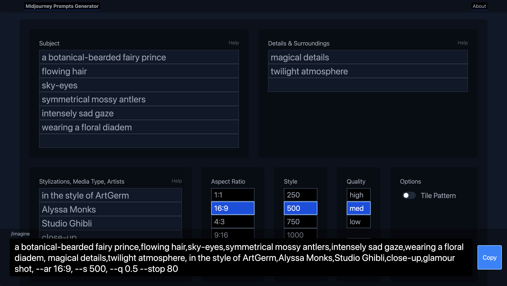

# Midjourney Prompts

🔗 [martinschaer.github.io/midjourney-prompts](https://martinschaer.github.io/midjourney-prompts/)



## To-do

- autocomplete previously used component values
- define components and options in a JSON file for easy update of rules
- group saved prompts in projects
- attach generated image URLs to saved prompts
- link to midjourney explore

## Project initialization

Instruction with pnpm, but currently I'm using npm instead only because it's convinient for deploying to Github Pages —where this app is currently hosted.

Refer to the [initial commits](https://github.com/martinschaer/midjourney-prompts/commits/main) of this repo.

```bash
# init project using vite
# select react and typescript + SWC when prompted

# Using pnpm:
pnpm create vite

# Using npm:
npm create vite@latest

# change directory
cd midjourney-prompts

# install deps
pnpm install
# or
npm install

# init repo
git init
git add .
git commit -m "init"

# install prettier
# see git commit for files that need to be created manually
pnpm add -D prettier
# or
npm i -D prettier

# install tailwind
pnpm add -D tailwindcss postcss autoprefixer
#or
npm i -D tailwindcss postcss autoprefixer

# init tailwind
npx tailwindcss init -p

# follow this guide: https://tailwindcss.com/docs/guides/vite

# We are not using react-router on this project but if you are following this as a guide for your own project, this may be helpful
pnpm add @tanstack/react-query
# or
npm i @tanstack/react-query

# install router (note: tanstack router is in beta, you may want to use another router)
pnpm add @tanstack/router@beta
# or
npm i @tanstack/router@beta

```

## Build and deploy

Deploying on Github Pages. Build script is in [.github/workflows/main.yml](./.github/workflows/main.yml).
